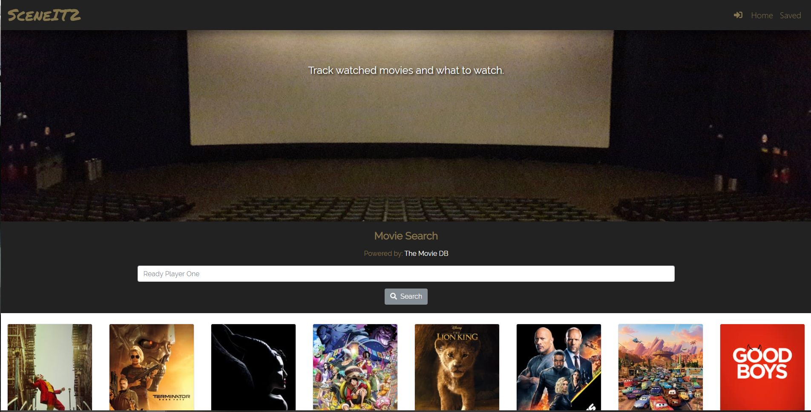
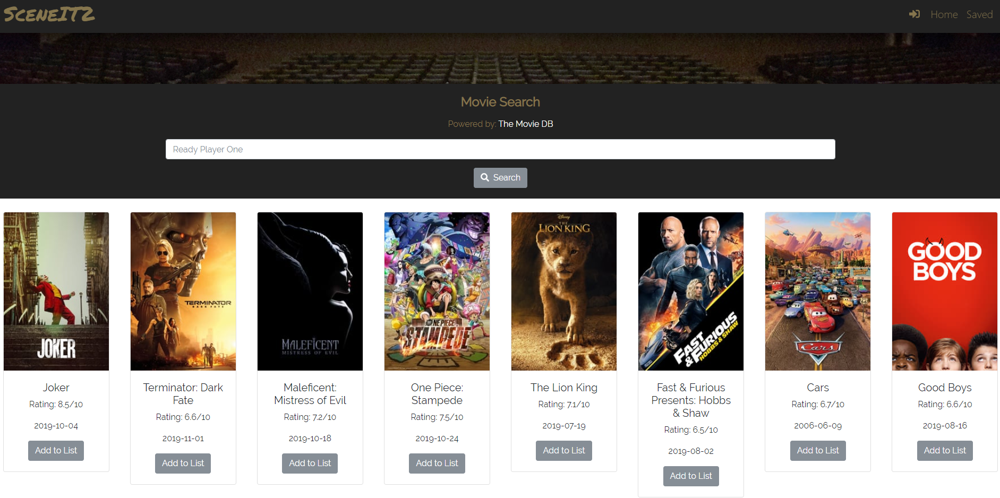
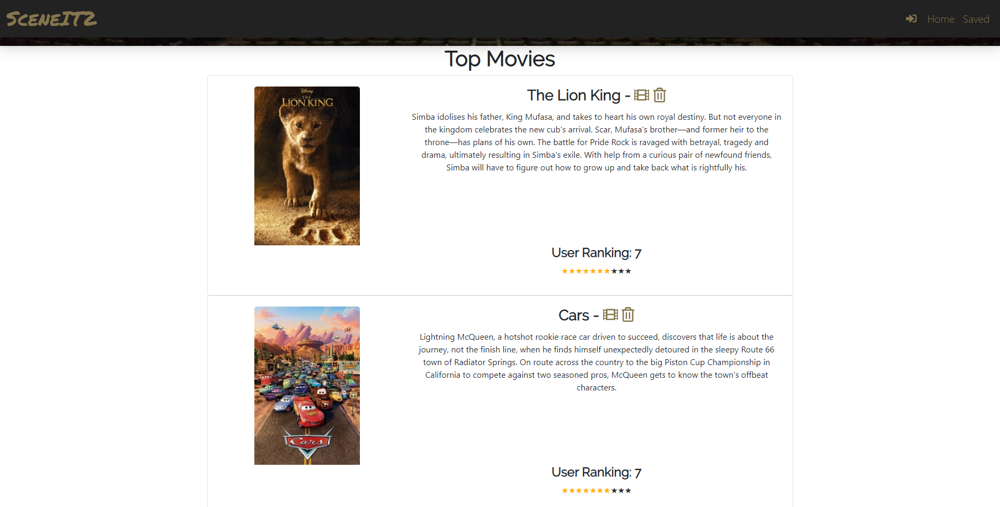

# SceneIT2

Hosted on Heroku: https://sceneit2-h.herokuapp.com/

## Description

* This application allows users to keep a record of movies that they would like to watch or have already watched. MVP of the project is a personalized movie checklist with user ranking.

* Users can search for movies in the search bar and all movies with related titles will appear. They can "save" the movie to their own personal list to access on their next movie binge night.

* Target Audience: Movie fanatics, Individuals, and Groups of friends.

## Screenshots

### Home page with pre populated top movies.

### Movie results.

### Movie list of saved movies.

## Technologies Used

* `React`
* `React Developer Tools`
* `MySQL`
* `Axios`
* `Node.js`
* `Express`
* `Javascript`
* `Bootstrap`
* `React Bootstrap`
* `Font Awesome`
* `Google Font`
* `Roundicon`
* `Heroku`
* `The Movie Database (TMDb) API`
* `Google Sign In API`

## Team Members

* Allan Angeles - https://github.com/AllanAngeles96
* Christina Chon - https://github.com/christinachon
* Sang Huynh - https://github.com/huynhts
* Huy Nguyen - https://github.com/w3fl3x